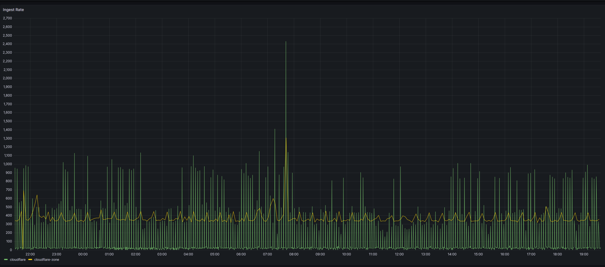

Sample of using Axiom with Worker Trace Events Logpush

All Credit to https://gist.github.com/stefandanaita/88c4d8b187400d5b07524cd0a12843b2 for most of the code.

# How To Use

## Clone Repo


## Add Authorization Secret
 wrangler secret put AuthSecret
 > This is just Axiom's API Token


 ## Add Logpush Secret
 wrangler secret put LogPushSecret
 > The value can be whatever you want. It's the secret you will use in your logpush config to make sure only logpush can use the endpoint. Make it reasonably secure.

## Deploy
wrangler publish

## Create LogPush Job
Example:
```
curl -s -X POST 'https://api.cloudflare.com/client/v4/accounts/{AccountID}/logpush/jobs' -X POST -d '
{
  "name": "logpush-to-worker",
  "destination_conf": "https://{YourWorkerName}.{YourSubdomain}.workers.dev/cloudflare?header_Authorization={LogPushSecret}",
  "dataset": "workers_trace_events",
  "enabled": true,
  "frequency": "high"
}' -H "X-Auth-Email: ....." -H "X-Auth-Key: ...."
```
Frequency options are "low" or "high". 

Insert your Account ID (find in Workers Tab on Right side), your worker domain, your logpush secret, and CF API Auth Details (either Global API Key or API Token)

The dataset is the path.


CF will send a test event. If it works, then congrats you're done. Check in Axiom for your events and take a nap.

## Analytics Engine
You can uncomment the Analytics Engine block in wrangler.toml, to log ingest information to Analytics Engine. In this repo, simple-dashboard.json is a simple Grafana dashboard for showing its information, using the Altinity Plugin for Clickhouse. Set up Grafana with AE with this guide: https://developers.cloudflare.com/analytics/analytics-engine/grafana/

